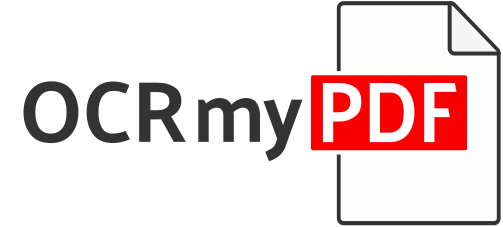

<!-- SPDX-FileCopyrightText: 2014 Julien Pfefferkorn -->
<!-- SPDX-FileCopyrightText: 2015 James R. Barlow -->
<!-- SPDX-License-Identifier: CC-BY-SA-4.0 -->



[](https://github.com/ocrmypdf/OCRmyPDF/actions/workflows/build.yml) [![PyPI version][pypi]](https://pypi.org/project/ocrmypdf/) ![Homebrew version][homebrew] ![ReadTheDocs][docs] ![Python versions][pyversions]

[pypi]: https://img.shields.io/pypi/v/ocrmypdf.svg "PyPI version"
[homebrew]: https://img.shields.io/homebrew/v/ocrmypdf.svg "Homebrew version"
[docs]: https://readthedocs.org/projects/ocrmypdf/badge/?version=latest "RTD"
[pyversions]: https://img.shields.io/pypi/pyversions/ocrmypdf "Supported Python versions"

OCRmyPDF adds an OCR text layer to scanned PDF files, allowing them to be searched or copy-pasted.

```bash
ocrmypdf                      # it's a scriptable command line program
   -l eng+fra                 # it supports multiple languages
   --rotate-pages             # it can fix pages that are misrotated
   --deskew                   # it can deskew crooked PDFs!
   --title "My PDF"           # it can change output metadata
   --jobs 4                   # it uses multiple cores by default
   --output-type pdfa         # it produces PDF/A by default
   input_scanned.pdf          # takes PDF input (or images)
   output_searchable.pdf      # produces validated PDF output
```

[See the release notes for details on the latest changes](https://ocrmypdf.readthedocs.io/en/latest/release_notes.html).

## Main features

- Generates a searchable [PDF/A](https://en.wikipedia.org/?title=PDF/A) file from a regular PDF
- Places OCR text accurately below the image to ease copy / paste
- Keeps the exact resolution of the original embedded images
- When possible, inserts OCR information as a "lossless" operation without disrupting any other content
- Optimizes PDF images, often producing files smaller than the input file
- If requested, deskews and/or cleans the image before performing OCR
- Validates input and output files
- Distributes work across all available CPU cores
- Uses [Tesseract OCR](https://github.com/tesseract-ocr/tesseract) engine to recognize more than [100 languages](https://github.com/tesseract-ocr/tessdata)
- Keeps your private data private.
- Scales properly to handle files with thousands of pages.
- Battle-tested on millions of PDFs.


For details: please consult the [documentation](https://ocrmypdf.readthedocs.io/en/latest/).

## Motivation

I searched the web for a free command line tool to OCR PDF files: I found many, but none of them were really satisfying:

- Either they produced PDF files with misplaced text under the image (making copy/paste impossible)
- Or they did not handle accents and multilingual characters
- Or they changed the resolution of the embedded images
- Or they generated ridiculously large PDF files
- Or they crashed when trying to OCR
- Or they did not produce valid PDF files
- On top of that none of them produced PDF/A files (format dedicated for long time storage)

...so I decided to develop my own tool.

## Installation

Linux, Windows, macOS and FreeBSD are supported. Docker images are also available, for both x64 and ARM.

| Operating system              | Install command               |
| ----------------------------- | ------------------------------|
| Debian, Ubuntu                | ``apt install ocrmypdf``      |
| Windows Subsystem for Linux   | ``apt install ocrmypdf``      |
| Fedora                        | ``dnf install ocrmypdf``      |
| macOS (Homebrew)              | ``brew install ocrmypdf``     |
| macOS (MacPorts)              | ``port install ocrmypdf``     |
| macOS (nix)                   | ``nix-env -i ocrmypdf``       |
| LinuxBrew                     | ``brew install ocrmypdf``     |
| FreeBSD                       | ``pkg install py-ocrmypdf``   |
| Conda                         | ``conda install ocrmypdf``    |
| Ubuntu Snap                   | ``snap install ocrmypdf``     |

For everyone else, [see our documentation](https://ocrmypdf.readthedocs.io/en/latest/installation.html) for installation steps.

## Languages

OCRmyPDF uses Tesseract for OCR, and relies on its language packs. For Linux users, you can often find packages that provide language packs:

```bash
# Display a list of all Tesseract language packs
apt-cache search tesseract-ocr

# Debian/Ubuntu users
apt-get install tesseract-ocr-chi-sim  # Example: Install Chinese Simplified language pack

# Arch Linux users
pacman -S tesseract-data-eng tesseract-data-deu # Example: Install the English and German language packs

# brew macOS users
brew install tesseract-lang
```

You can then pass the `-l LANG` argument to OCRmyPDF to give a hint as to what languages it should search for. Multiple languages can be requested.

OCRmyPDF supports Tesseract 4.1.1+. It will automatically use whichever version it finds first on the `PATH` environment variable. On Windows, if `PATH` does not provide a Tesseract binary, we use the highest version number that is installed according to the Windows Registry.

## Documentation and support

Once OCRmyPDF is installed, the built-in help which explains the command syntax and options can be accessed via:

```bash
ocrmypdf --help
```

Our [documentation is served on Read the Docs](https://ocrmypdf.readthedocs.io/en/latest/index.html).

Please report issues on our [GitHub issues](https://github.com/ocrmypdf/OCRmyPDF/issues) page, and follow the issue template for quick response.

## Requirements

In addition to the required Python version (3.8+), OCRmyPDF requires external program installations of Ghostscript and Tesseract OCR. OCRmyPDF is pure Python, and runs on pretty much everything: Linux, macOS, Windows and FreeBSD.

## Press & Media

- [Going paperless with OCRmyPDF](https://medium.com/@ikirichenko/going-paperless-with-ocrmypdf-e2f36143f46a)
- [Converting a scanned document into a compressed searchable PDF with redactions](https://medium.com/@treyharris/converting-a-scanned-document-into-a-compressed-searchable-pdf-with-redactions-63f61c34fe4c)
- [c't 1-2014, page 59](https://heise.de/-2279695): Detailed presentation of OCRmyPDF v1.0 in the leading German IT magazine c't
- [heise Open Source, 09/2014: Texterkennung mit OCRmyPDF](https://heise.de/-2356670)
- [heise Durchsuchbare PDF-Dokumente mit OCRmyPDF erstellen](https://www.heise.de/ratgeber/Durchsuchbare-PDF-Dokumente-mit-OCRmyPDF-erstellen-4607592.html)
- [Excellent Utilities: OCRmyPDF](https://www.linuxlinks.com/excellent-utilities-ocrmypdf-add-ocr-text-layer-scanned-pdfs/)
- [LinuxUser Texterkennung mit OCRmyPDF und Scanbd automatisieren](https://www.linux-community.de/ausgaben/linuxuser/2021/06/texterkennung-mit-ocrmypdf-und-scanbd-automatisieren/)
- [Y Combinator discussion](https://news.ycombinator.com/item?id=32028752)

## Business enquiries

OCRmyPDF would not be the software that it is today without companies and users choosing to provide support for feature development and consulting enquiries. We are happy to discuss all enquiries, whether for extending the existing feature set, or integrating OCRmyPDF into a larger system.

## License

The OCRmyPDF software is licensed under the Mozilla Public License 2.0 (MPL-2.0). This license permits integration of OCRmyPDF with other code, included commercial and closed source, but asks you to publish source-level modifications you make to OCRmyPDF.

Some components of OCRmyPDF have other licenses, as indicated by standard SPDX license identifiers or the DEP5 copyright and licensing information file. Generally speaking, non-core code is licensed under MIT, and the documentation and test files are licensed under Creative Commons ShareAlike 4.0 (CC-BY-SA 4.0).

## Disclaimer

The software is distributed on an "AS IS" BASIS, WITHOUT WARRANTIES OR CONDITIONS OF ANY KIND, either express or implied.
