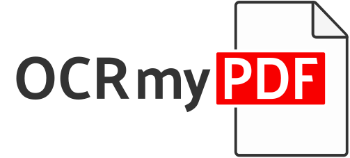

<!-- SPDX-FileCopyrightText: 2014 Julien Pfefferkorn -->
<!-- SPDX-FileCopyrightText: 2015 James R. Barlow -->
<!-- SPDX-License-Identifier: CC-BY-SA-4.0 -->



[](https://github.com/ocrmypdf/OCRmyPDF/actions/workflows/build.yml) [![PyPI 版本][pypi]](https://pypi.org/project/ocrmypdf/) ![Homebrew 版本][homebrew] ![ReadTheDocs][docs] ![Python 版本][pyversions]

[pypi]: https://img.shields.io/pypi/v/ocrmypdf.svg "PyPI 版本"
[homebrew]: https://img.shields.io/homebrew/v/ocrmypdf.svg "Homebrew 版本"
[docs]: https://readthedocs.org/projects/ocrmypdf/badge/?version=latest "RTD"
[pyversions]: https://img.shields.io/pypi/pyversions/ocrmypdf "支持的 Python 版本"

OCRmyPDF 会为扫描版 PDF 文件添加 OCR 文本层，使其可以搜索或复制粘贴。

```bash
ocrmypdf                      # 它是一个可脚本化的命令行程序
   -l eng+fra                 # 它支持多种语言
   --rotate-pages             # 它可以修正旋转方向错误的页面
   --deskew                   # 它可以校正歪斜的 PDF！
   --title "My PDF"           # 它可以更改输出元数据
   --jobs 4                   # 它默认使用多个 CPU 核心
   --output-type pdfa         # 它默认生成 PDF/A
   input_scanned.pdf          # 接受 PDF 输入（或图像）
   output_searchable.pdf      # 生成经过验证的 PDF 输出
```

[查看发布说明，了解最新变更详情](https://ocrmypdf.readthedocs.io/en/latest/release_notes.html)。

## 主要功能

- 从普通 PDF 生成可搜索的 [PDF/A](https://en.wikipedia.org/?title=PDF/A) 文件
- 将 OCR 文本准确放置在图像下方，便于复制/粘贴
- 保持原始嵌入图像的精确分辨率
- 在可能时，以“无损”操作插入 OCR 信息，不干扰任何其他内容
- 优化 PDF 图像，通常生成比输入文件更小的文件
- 按需在执行 OCR 前校正和/或清理图像
- 验证输入和输出文件
- 在所有可用 CPU 核心间分配工作
- 使用 [Tesseract OCR](https://github.com/tesseract-ocr/tesseract) 引擎识别超过 [100 种语言](https://github.com/tesseract-ocr/tessdata)
- 保护你的私有数据。
- 可以妥善扩展，处理包含数千页的文件。
- 已在数百万份 PDF 上经过实战检验。


详情请参阅[文档](https://ocrmypdf.readthedocs.io/en/latest/)。

## 动机

我曾在网上寻找一款免费的命令行工具来对 PDF 文件执行 OCR：我找到了很多，但没有一个真正令人满意：

- 要么生成的 PDF 文件中文本位于图像下方的错误位置（导致无法复制/粘贴）
- 要么无法处理重音字符和多语言字符
- 要么会改变嵌入图像的分辨率
- 要么生成的 PDF 文件大得离谱
- 要么在尝试 OCR 时崩溃
- 要么无法生成有效的 PDF 文件
- 除此之外，它们都不能生成 PDF/A 文件（专为长期存储设计的格式）

……所以我决定开发自己的工具。

## 安装

支持 Linux、Windows、macOS 和 FreeBSD。也提供 Docker 镜像，同时支持 x64 和 ARM。

| 操作系统                      | 安装命令                       |
| ----------------------------- | ------------------------------ |
| Debian, Ubuntu                | ``apt install ocrmypdf``       |
| Windows Subsystem for Linux   | ``apt install ocrmypdf``       |
| Fedora                        | ``dnf install ocrmypdf``       |
| macOS (Homebrew)              | ``brew install ocrmypdf``      |
| macOS (MacPorts)              | ``port install ocrmypdf``      |
| macOS (nix)                   | ``nix-env -i ocrmypdf``        |
| LinuxBrew                     | ``brew install ocrmypdf``      |
| FreeBSD                       | ``pkg install py-ocrmypdf``    |
| OpenBSD                       | ``pkg_add ocrmypdf``           |
| Ubuntu Snap                   | ``snap install ocrmypdf``      |

其他用户请[参阅我们的文档](https://ocrmypdf.readthedocs.io/en/latest/installation.html)了解安装步骤。

## 语言

OCRmyPDF 使用 Tesseract 执行 OCR，并依赖其语言包。对于 Linux 用户，通常可以找到提供语言包的软件包：

```bash

# Debian/Ubuntu 用户
apt-cache search tesseract-ocr # 显示所有 Tesseract 语言包列表
apt-get install tesseract-ocr-chi-sim  # 示例：安装简体中文语言包


# Arch Linux 用户
pacman -S tesseract-data-eng tesseract-data-deu # 示例：安装英语和德语语言包

# OpenBSD 用户
pkg_info -aQ tesseract  # 显示所有 Tesseract 语言包列表
pkg_add tesseract-cym  # 示例：安装威尔士语语言包

# brew macOS 用户
brew install tesseract-lang

# Fedora 用户
dnf search tesseract-langpack # 显示所有 Tesseract 语言包列表
dnf install tesseract-langpack-ita # 示例：安装意大利语语言包


```

随后可以向 OCRmyPDF 传递 `-l LANG` 参数，提示它应搜索哪些语言。可以同时请求多种语言。

OCRmyPDF 支持 Tesseract 4.1.1+。它会自动使用 `PATH` 环境变量中首先找到的版本。在 Windows 上，如果 `PATH` 中没有 Tesseract 二进制文件，我们会根据 Windows 注册表使用已安装的最高版本号。

## 文档和支持

安装 OCRmyPDF 后，可以通过以下命令访问内置帮助，了解命令语法和选项：

```bash
ocrmypdf --help
```

我们的[文档托管在 Read the Docs 上](https://ocrmypdf.readthedocs.io/en/latest/index.html)。

请在我们的 [GitHub issues](https://github.com/ocrmypdf/OCRmyPDF/issues) 页面报告问题，并遵循 issue 模板以便快速获得响应。

## 功能演示

```bash
# 添加 OCR 层并要求输出 PDF/A
ocrmypdf --output-type pdfa input.pdf output.pdf

# 将图像转换为单页 PDF
ocrmypdf input.jpg output.pdf

# 就地为文件添加 OCR（仅在成功时修改文件）
ocrmypdf myfile.pdf myfile.pdf

# 使用非英语语言执行 OCR（请查找对应语言的 ISO 639-3 代码）
ocrmypdf -l fra LeParisien.pdf LeParisien.pdf

# OCR 多语言文档
ocrmypdf -l eng+fra Bilingual-English-French.pdf Bilingual-English-French.pdf

# 校正歪斜页面
ocrmypdf --deskew input.pdf output.pdf
```

更多功能请参阅[文档](https://ocrmypdf.readthedocs.io/en/latest/index.html)。

## 要求

除所需的 Python 版本外，OCRmyPDF 还需要安装 Ghostscript 和 Tesseract OCR 这两个外部程序。OCRmyPDF 是纯 Python 项目，几乎可以在所有平台上运行：Linux、macOS、Windows 和 FreeBSD。

## 插件

OCRmyPDF 提供插件接口，允许扩展或替换其能力。以下是我们知道的一些插件：

- [OCRmyPDF-AppleOCR](https://github.com/mkyt/ocrmypdf-AppleOCR)：用 Apple Vision Framework 替换标准 Tesseract OCR 引擎。需要 macOS。
- [OCRmyPDF-EasyOCR](https://github.com/ocrmypdf/OCRmyPDF-EasyOCR)：用 EasyOCR 替换标准 Tesseract OCR 引擎；EasyOCR 是基于 PyTorch 的较新 OCR 引擎。强烈建议使用 GPU。
- [OCRmyPDF-PaddleOCR](https://github.com/clefru/ocrmypdf-paddleocr)：用 PaddleOCR 替换标准 Tesseract OCR 引擎；PaddleOCR 是功能强大的 GPU 加速 OCR 引擎。

[paperless-ngx](https://docs.paperless-ngx.com/) 将 OCRmyPDF 集成到可搜索的文档管理系统中。

## 新闻与媒体

- [Going paperless with OCRmyPDF](https://medium.com/@ikirichenko/going-paperless-with-ocrmypdf-e2f36143f46a)
- [Converting a scanned document into a compressed searchable PDF with redactions](https://medium.com/@treyharris/converting-a-scanned-document-into-a-compressed-searchable-pdf-with-redactions-63f61c34fe4c)
- [c't 1-2014，第 59 页](https://web.archive.org/web/20220115123833/https://www.heise.de/ct/ausgabe/2014-1-kurz-vorgestellt-Texterkennung-2279695.html)：德国领先 IT 杂志 c't 对 OCRmyPDF v1.0 的详细介绍
- [heise Open Source, 09/2014: Texterkennung mit OCRmyPDF](https://heise.de/-2356670)
- [heise Durchsuchbare PDF-Dokumente mit OCRmyPDF erstellen](https://www.heise.de/ratgeber/Durchsuchbare-PDF-Dokumente-mit-OCRmyPDF-erstellen-4607592.html)
- [Excellent Utilities: OCRmyPDF](https://www.linuxlinks.com/excellent-utilities-ocrmypdf-add-ocr-text-layer-scanned-pdfs/)
- [LinuxUser Texterkennung mit OCRmyPDF und Scanbd automatisieren](https://www.linux-community.de/ausgaben/linuxuser/2021/06/texterkennung-mit-ocrmypdf-und-scanbd-automatisieren/)
- [Y Combinator discussion](https://news.ycombinator.com/item?id=32028752)

## 商务咨询

如果没有公司和用户选择支持功能开发与咨询服务，OCRmyPDF 不会成为今天的软件。无论是扩展现有功能集，还是将 OCRmyPDF 集成到更大的系统中，我们都很乐意讨论各类咨询需求。

## 许可证

OCRmyPDF 软件采用 Mozilla Public License 2.0 (MPL-2.0) 授权。该许可证允许将 OCRmyPDF 与其他代码集成，包括商业代码和闭源代码，但要求你发布对 OCRmyPDF 所做的源代码级修改。

OCRmyPDF 的某些组件采用其他许可证，具体由标准 SPDX 许可证标识符或 DEP5 版权与许可信息文件标明。一般来说，非核心代码采用 MIT 许可证，文档和测试文件采用 Creative Commons ShareAlike 4.0 (CC-BY-SA 4.0) 许可证。

## 免责声明

本软件按“原样”分发，不提供任何明示或暗示的保证或条件。
