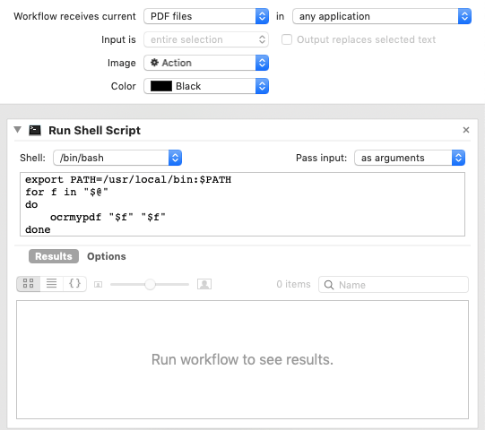

================
Batch processing
================

This article provides information about running OCRmyPDF on multiple
files or configuring it as a service triggered by file system events.

Batch jobs
==========

Consider using the excellent `GNU
Parallel <https://www.gnu.org/software/parallel/>`__ to apply OCRmyPDF
to multiple files at once.

Both ``parallel`` and ``ocrmypdf`` will try to use all available
processors. To maximize parallelism without overloading your system with
processes, consider using ``parallel -j 2`` to limit parallel to running
two jobs at once.

This command will run all ocrmypdf all files named ``*.pdf`` in the
current directory and write them to the previous created ``output/``
folder. It will not search subdirectories.

The ``--tag`` argument tells parallel to print the filename as a prefix
whenever a message is printed, so that one can trace any errors to the
file that produced them.

.. code-block:: bash

   parallel --tag -j 2 ocrmypdf '{}' 'output/{}' ::: *.pdf

OCRmyPDF automatically repairs PDFs before parsing and gathering
information from them.

Directory trees
===============

This will walk through a directory tree and run OCR on all files in
place, printing the output in a way that makes

.. code-block:: bash

   find . -printf '%p' -name '*.pdf' -exec ocrmypdf '{}' '{}' \;

Alternatively, with a docker container (mounts a volume to the container
where the PDFs are stored):

.. code-block:: bash

   find . -printf '%p' -name '*.pdf' -exec docker run --rm -v <host dir>:<container dir> jbarlow83/ocrmypdf '<container dir>/{}' '<container dir>/{}' \;

This only runs one ``ocrmypdf`` process at a time. This variation uses
``find`` to create a directory list and ``parallel`` to parallelize runs
of ``ocrmypdf``, again updating files in place.

.. code-block:: bash

   find . -name '*.pdf' | parallel --tag -j 2 ocrmypdf '{}' '{}'

In a Windows batch file, use

.. code-block:: bat

   for /r %%f in (*.pdf) do ocrmypdf %%f %%f

Sample script
-------------

This user contributed script also provides an example of batch
processing.

.. literalinclude:: ../misc/batch.py
    :caption: misc/batch.py

Synology DiskStations
---------------------

Synology DiskStations (Network Attached Storage devices) can run the
Docker image of OCRmyPDF if the Synology `Docker
package <https://www.synology.com/en-global/dsm/packages/Docker>`__ is
installed. Attached is a script to address particular quirks of using
OCRmyPDF on one of these devices.

This is only possible for x86-based Synology products. Some Synology
products use ARM or Power processors and do not support Docker. Further
adjustments might be needed to deal with the Synology's relatively
limited CPU and RAM.

.. literalinclude:: ../misc/synology.py
    :caption: misc/synology.py - Sample script for Synology DiskStations

Huge batch jobs
---------------

If you have thousands of files to work with, contact the author.
Consulting work related to OCRmyPDF helps fund this open source project
and all inquiries are appreciated.

Hot (watched) folders
=====================

Watched folders with watcher.py
-------------------------------

OCRmyPDF has a folder watcher called watcher.py, which is currently included in source
distributions but not part of the main program. It may be used natively or may run
in a Docker container. Native instances tend to give better performance. watcher.py
works on all platforms.

Users may need to customize the script to meet their requirements.

.. code-block:: bash

    pip3 install -r requirements/watcher.txt

    env OCR_INPUT_DIRECTORY=/mnt/input-pdfs \
        OCR_OUTPUT_DIRECTORY=/mnt/output-pdfs \
        OCR_OUTPUT_DIRECTORY_YEAR_MONTH=1 \
        python3 watcher.py

.. csv-table:: watcher.py environment variables
    :header: "Environment variable", "Description"
    :widths: 50, 50

    "OCR_INPUT_DIRECTORY", "Set input directory to monitor (recursive)"
    "OCR_OUTPUT_DIRECTORY", "Set output directory (should not be under input)"
    "OCR_ON_SUCCESS_DELETE", "This will delete the input file if the exit code is 0 (OK)"
    "OCR_OUTPUT_DIRECTORY_YEAR_MONTH", "This will place files in the output in ``{output}/{year}/{month}/{filename}``"
    "OCR_DESKEW", "Apply deskew to crooked input PDFs"
    "OCR_JSON_SETTINGS", "A JSON string specifying any other arguments for ``ocrmypdf.ocr``, e.g. ``'OCR_JSON_SETTINGS={""rotate_pages"": true}'``."
    "OCR_POLL_NEW_FILE_SECONDS", "Polling interval"
    "OCR_LOGLEVEL", "Level of log messages to report"

One could configure a networked scanner or scanning computer to drop files in the
watched folder.

Watched folders with Docker
---------------------------

The watcher service is included in the OCRmyPDF Docker image. To run it:

.. code-block:: bash

    docker run \
        -v <path to files to convert>:/input \
        -v <path to store results>:/output \
        -e OCR_OUTPUT_DIRECTORY_YEAR_MONTH=1 \
        -e OCR_ON_SUCCESS_DELETE=1 \
        -e OCR_DESKEW=1 \
        -e PYTHONUNBUFFERED=1 \
        -it --entrypoint python3 \
        jbarlow83/ocrmypdf \
        watcher.py

This service will watch for a file that matches ``/input/\*.pdf`` and will
convert it to a OCRed PDF in ``/output/``. The parameters to this image are:

.. csv-table:: watcher.py parameters for Docker
    :header: "Parameter", "Description"
    :widths: 50, 50

    "``-v <path to files to convert>:/input``", "Files placed in this location will be OCRed"
    "``-v <path to store results>:/output``", "This is where OCRed files will be stored"
    "``-e OCR_OUTPUT_DIRECTORY_YEAR_MONTH=1``", "Define environment variable OCR_OUTPUT_DIRECTORY_YEAR_MONTH=1"
    "``-e OCR_ON_SUCCESS_DELETE=1``", "Define environment variable"
    "``-e OCR_DESKEW=1``", "Define environment variable"
    "``-e PYTHONBUFFERED=1``", "This will force STDOUT to be unbuffered and allow you to see messages in docker logs"

This service relies on polling to check for changes to the filesystem. It
may not be suitable for some environments, such as filesystems shared on a
slow network.

A configuration manager such as Docker Compose could be used to ensure that the
service is always available.

.. literalinclude:: ../misc/docker-compose.example.yml
    :language: yaml
    :caption: misc/docker-compose.example.yml

Caveats
-------

-  ``watchmedo`` may not work properly on a networked file system,
   depending on the capabilities of the file system client and server.
-  This simple recipe does not filter for the type of file system event,
   so file copies, deletes and moves, and directory operations, will all
   be sent to ocrmypdf, producing errors in several cases. Disable your
   watched folder if you are doing anything other than copying files to
   it.
-  If the source and destination directory are the same, watchmedo may
   create an infinite loop.
-  On BSD, FreeBSD and older versions of macOS, you may need to increase
   the number of file descriptors to monitor more files, using
   ``ulimit -n 1024`` to watch a folder of up to 1024 files.

Alternatives
------------

-  On Linux, `systemd user services <https://wiki.archlinux.org/index.php/Systemd/User>`__
   can be configured to automatically perform OCR on a collection of files.

-  `Watchman <https://facebook.github.io/watchman/>`__ is a more
   powerful alternative to ``watchmedo``.

macOS Automator
===============

You can use the Automator app with macOS, to create a Workflow or Quick
Action. Use a *Run Shell Script* action in your workflow. In the context
of Automator, the ``PATH`` may be set differently your Terminal's
``PATH``; you may need to explicitly set the PATH to include
``ocrmypdf``. The following example may serve as a starting point:

You may customize the command sent to ocrmypdf.
