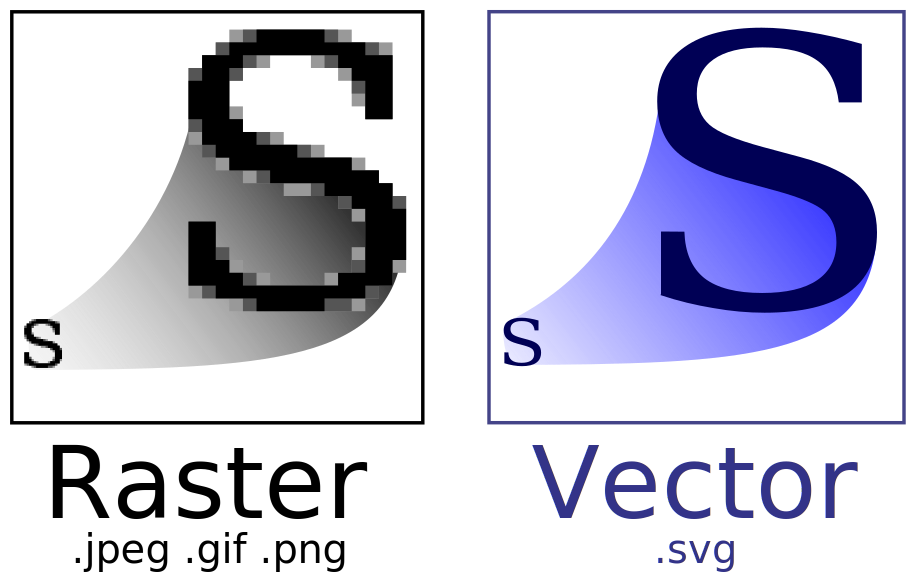

.. SPDX-FileCopyrightText: 2022 James R. Barlow
..
.. SPDX-License-Identifier: CC-BY-SA-4.0

============
Introduction
============

OCRmyPDF is a Python application and library that adds text "layers" to images in
PDFs, making scanned image PDFs searchable. It uses OCR to guess the text
contained in images. OCRmyPDF also supports plugins
that enable customization of its processing steps, and it is highly tolerant
of PDFs containing scanned images and "born digital" content that doesn't
require text recognition.

About OCR
=========

`Optical character
recognition <https://en.wikipedia.org/wiki/Optical_character_recognition>`__
is a technology that converts images of typed or handwritten text, such as
in a scanned document, into computer text that can be selected, searched and copied.

OCRmyPDF uses
`Tesseract <https://github.com/tesseract-ocr/tesseract>`__, a widely
available open source OCR engine, to perform OCR.

.. _raster-vector:

About PDFs
==========

PDFs are page description files that attempt to preserve a layout
exactly. They contain `vector
graphics <http://vector-conversions.com/vectorizing/raster_vs_vector.html>`__
that can contain raster objects, such as scanned images. Because PDFs can
contain multiple pages (unlike many image formats) and can contain fonts
and text, they are a suitable format for exchanging scanned documents.

|image|

A PDF page may contain multiple images, even if it appears to have only
one image. Some scanners or scanning software may segment pages into
monochromatic text and color regions, for example, to enhance the compression
ratio and appearance of the page.

Rasterizing a PDF is the process of generating corresponding raster images.
OCR engines like Tesseract work with images, not scalable vector graphics
or mixed raster-vector-text graphics such as PDF.

About PDF/A
===========

`PDF/A <https://en.wikipedia.org/wiki/PDF/A>`__ is an ISO-standardized
subset of the full PDF specification that is designed for archiving (the
'A' stands for Archive). PDF/A differs from PDF primarily by omitting
features that could complicate future file readability,
such as embedded Javascript, video, audio and references to external
fonts. All fonts and resources needed to interpret the PDF must be
contained within it. Because PDF/A disables Javascript and other types
of embedded content, it is likely more secure.

There are various conformance levels and versions, such as "PDF/A-2b".

In general, the preferred format for scanned documents is PDF/A. Some
governments and jurisdictions, US Courts in particular, `mandate the use
of PDF/A <https://pdfblog.com/2012/02/13/what-is-pdfa/>`__ for scanned
documents.

Since most individuals scanning documents aim for long-term readability,
OCRmyPDF defaults to generating PDF/A-2b.

PDF/A does have a few drawbacks. Some PDF viewers display an alert
indicating that the file is in PDF/A format, which may confuse some users.
Additionally, it tends to result in larger files than standard PDFs because
it embeds certain resources, even if they are widely available. PDF/A
files can be digitally signed but may not be encrypted to ensure future
readability. Fortunately, converting from PDF/A to a regular PDF is
straightforward, and any PDF viewer can handle PDF/A files.

What OCRmyPDF does
==================

OCRmyPDF analyzes each page of a PDF to determine the required colorspace
and resolution (DPI) for capturing all the information on that page without
losing content. It uses
`Ghostscript <http://ghostscript.com/>`__ to rasterize each page and subsequently
performs OCR on the rasterized image to generate an OCR "layer." This layer
is then integrated back into the original PDF.

While it is possible to use a program like Ghostscript or ImageMagick to
obtain an image and then run that image through Tesseract OCR, this process
actually generates a new PDF, potentially resulting in the loss of various
details (such as the document's metadata). In contrast, OCRmyPDF can produce
a minimally altered PDF as the output.

OCRmyPDF also offers several image processing options, such as deskew, which
enhances the visual quality of files and the accuracy of OCR. When these
options are utilized, the OCR layer is integrated into the processed image.

By default, OCRmyPDF generates archival PDFs in the PDF/A format, which is
a more rigid subset of PDF features designed for long-term archives. If you
prefer regular PDFs, you can disable this feature using the
``--output-type pdf`` option.

Why you shouldn't do this manually
==================================

A PDF is similar to an HTML file, in that it contains document structure
along with images. While some PDFs may solely display a full-page image,
they often contain additional content that would be forfeited if not preserved.

A manual process could take one of these approaches:

1. Rasterize each page as an image, perform OCR on the images, and then merge the
   output into a PDF. This method preserves the layout of each page, but
   resamples all images potentially leading to quality loss, increased file size,
   and the introduction of compression artifacts, among other issues.
2. Extract each image, OCR, and combine the output into a PDF. This approach
   loses the context in which images are used in the PDF, potentially resulting
   in loss of information related to scaling and position of images. Some scanned
   PDFs contain multiple images segmented into black and white, grayscale
   and color regions, with stencil masks to prevent overlap, as this can
   enhance the appearance of a file while reducing file size.
   Reassembling these images can be challenging, and risks losing vector art
   or text that is not part of an image.

In cases where a PDF solely serves as a container for images without any
rotation, scaling, or cropping, the second approach can be lossless.

OCRmyPDF uses various strategies depending on input options and the input PDF
itself. Generally, it rasterizes a page for OCR and then integrates the OCR
data back into the original PDF. This approach allows it to handle complex
PDFs and preserve their content as much as possible.

Furthermore, OCRmyPDF supports a wide range of edge cases that have emerged
during several years of development. It accommodates PDF features like
images within Form XObjects and pages with UserUnit scaling. It also
supports less common image formats like non-monochrome 1-bit images and
provides warnings about files you may not want to OCR. Thanks to tools
like pikepdf and QPDF, it can auto-repair damaged PDFs. You don't need to
understand the intricacies of these issues; you should be able to use
OCRmyPDF with any PDF file, and expect reasonable results.

Limitations
===========

OCRmyPDF is subject to limitations imposed by the Tesseract OCR engine.
These limitations are inherent to any software relying on Tesseract:

-  The OCR accuracy may not match that of commercial OCR solutions.
-  It is incapable of recognizing handwriting.
-  It may detect gibberish and report it as OCR output.
-  Results may be subpar when a document contains languages not specified
   in the ``-l LANG`` argument.
-  Tesseract may struggle to analyze the natural reading order of documents.
   For instance, it might fail to recognize two columns in a document and
   attempt to join text across columns.
-  Poor quality scans can result in subpar OCR quality. In other words, the
   quality of the OCR output depends on the quality of the input.
-  Tesseract does not provide information about the font family to which text
   belongs.
-  Tesseract does not divide text into paragraphs or headings. It only provides
   the text and its bounding box. As such, the generated PDF does not
   contain any information about the document's structure.

Ghostscript also imposes some limitations:

-  PDFs containing JPEG 2000-encoded content may be converted to JPEG
   encoding, which may introduce compression artifacts, if Ghostscript
   PDF/A is enabled.
-  Ghostscript may transcode grayscale and color images, potentially
   lossily, based on an internal algorithm. This
   behavior can be suppressed by setting ``--pdfa-image-compression`` to
   ``jpeg`` or ``lossless`` to set all images to one type or the other.
   Ghostscript lacks an option to maintain the input image's format.
   (Modern Ghostscript can copy JPEG images without transcoding them.)
-  Ghostscript's PDF/A conversion removes any XMP metadata that is not
   one of the standard XMP metadata namespaces for PDFs. In particular,
   PRISM Metadata is removed.
-  Ghostscript's PDF/A conversion may remove or deactivate
   hyperlinks and other active content.

You can use ``--output-type pdf`` to disable PDF/A conversion and produce
a standard, non-archival PDF.

Regarding OCRmyPDF itself:

-  PDFs using transparency are not currently represented in the test
   suite

Similar programs
================

To the author's knowledge, OCRmyPDF is the most feature-rich and
thoroughly tested command line OCR PDF conversion tool. If it does not
meet your needs, contributions and suggestions are welcome.

Ghostscript recently added three "pdfocr" output devices. They work by
rasterizing all content and converting all pages to a single colour space.

Web front-ends
==============

The Docker image of OCRmyPDF provides a web service front-end
that allows files to submitted over HTTP, and the results can be downloaded.
This is an HTTP server intended to demonstrate how OCRmyPDF can be
integrated into a web service. It is not intended to be deployed on the
public internet and does not provide any security measures.

In addition, the following third-party integrations are available:

-  `Paperless-ngx <https://docs.paperless-ngx.com/>`__ is a free software
   document management system that uses OCRmyPDF to perform OCR on
   uploaded documents.
-  `Nextcloud OCR <https://github.com/janis91/ocr>`__ is a free software
   plugin for the Nextcloud private cloud software.

OCRmyPDF is not designed to be secure against malware-bearing PDFs (see
`Using OCRmyPDF online <ocr-service>`__). Users should ensure they
comply with OCRmyPDF's licenses and the licenses of all dependencies. In
particular, OCRmyPDF requires Ghostscript, which is licensed under
AGPLv3.

